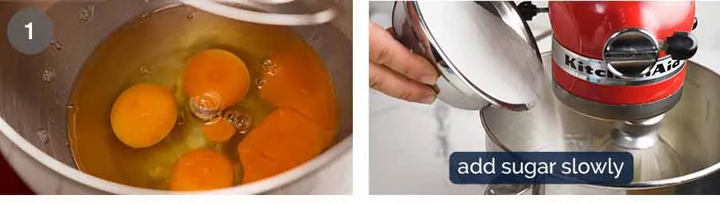

# How to make my best Vanilla Cake

A stand mixer makes this vanilla cake a breeze to make, though it can be made with a handheld electric beater. While it takes time to beat the eggs to make a lovely fluffy cake, this recipe is more fail-proof than the usual _“cream butter and sugar until fluffy”_ recipes – **read the above box for why.**

