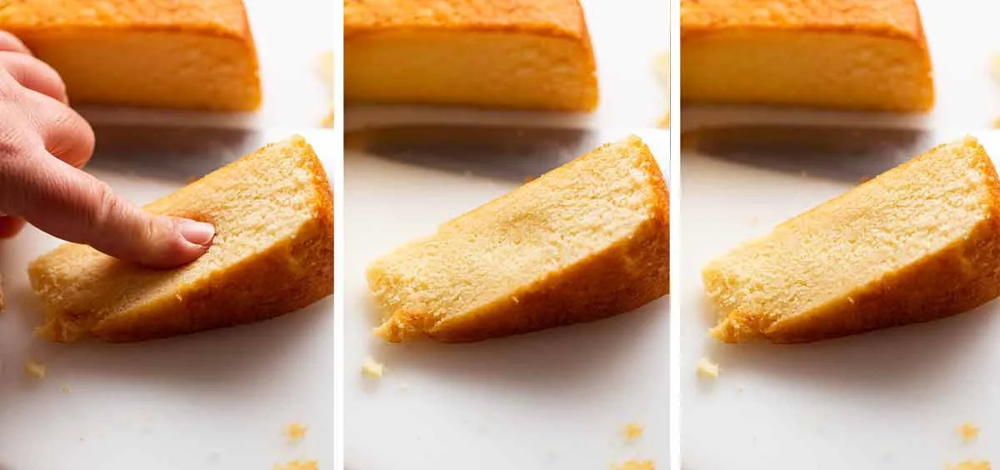

# Tips for Vanilla Cake success
You’ll love that this list is a lot less stern than many other cake recipes!

| what to concern | what to do |
|-|-|
| Eggs at room temperature  | these will fluff better and faster. It’s easy to warm up fridge cold eggs | just leave in warm water for 5 minutes. What’s a room temperature egg? Pick up the egg. Fridge cold? Too cold. Cool but not cold? That’s ok. Very warm? I would be worried they might be off! (Note: fridge cold eggs will still fluff just fine, but it takes a couple of minutes longer. Just more consistent results with room temp eggs).|
| De-chill icy cold mixing bowls | Cold kitchen? Cold bowls! Run them under warm tap water then dry before using. Not hot tap water | just warm. Why? Eggs aerate faster and better when slightly warm. Cold bowl will lower temperature of eggs. This is a general useful baking tip | eg softened butter creamed in an icy cold bowl will make it firm up.|
| Make sure your baking powder is still good | if you do everything right and the batter looks like it does in my video, but your cupcakes don’t rise, the culprit is probably your baking powder. Even if it’s not past the expiry date, if not stored in a cool dry place, or if “someone” left the lid off for days, it can lose rising power. See here for how to check if your baking powder is still good.|